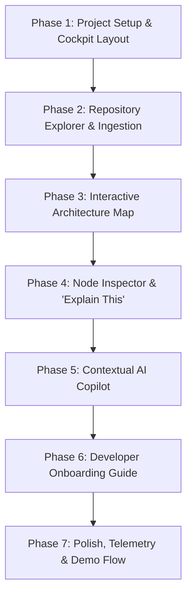

# 🛠️ RepoNavigator AI — Step-by-Step Development Plan

This document outlines the **7-Phase Implementation Plan** for RepoNavigator AI. Each phase includes explicit targets, files created/modified, testing milestones, and acceptance criteria.

---

## 🗺️ Roadmap Overview

---

## 📌 Phase 1: Project Setup & Cockpit Layout
**Goal**: Establish Next.js 16 + React 19 + Tailwind CSS foundation with the 3-column developer layout, top header, and bottom navigation dock.

### 📋 Deliverables
- [x] Next.js 16 initialized with TypeScript and Tailwind v4.
- [x] Global layout and font configuration in `app/layout.tsx`.
- [x] Top header with logo, repo selector, `⌘K` search shortcut, and pulsing `● Repository Ready` badge (`Header.tsx`).
- [x] Bottom dock with switchable tabs (`Overview | Architecture | Onboarding | Chat`) in `BottomBar.tsx`.
- [x] 3-Column Cockpit Grid container in `RepoNavigatorApp.tsx`.

### 🧪 What to Test After Phase 1
1. **Layout Integrity**: Check desktop viewport (>= 1280px) renders 3 distinct columns without horizontal page scrollbars.
2. **Tab Switching**: Click bottom tabs (`Overview`, `Architecture`, `Onboarding`, `Chat`) and verify active view states switch cleanly.
3. **Responsive Breakpoints**: Check that on small screens (< 768px), the main viewport switches cleanly between single-pane views.

---

## 📌 Phase 2: Repository Explorer & Ingestion Engine
**Goal**: Build the interactive file tree explorer, file preview modal, and GitHub repository importer.

### 📋 Deliverables
- [x] Repository tree data structure with line counts and file sizes (`data/repoData.ts`).
- [x] Recursive collapsible folder tree component (`RepositoryExplorer.tsx`).
- [x] Instant search/filter box for files and folders.
- [x] Source Code Viewer Modal (`FileViewerModal.tsx`) with syntax formatting and line numbers.
- [x] GitHub Repository Importer modal (`ImportRepoModal.tsx`) supporting custom URLs and templates.

### 🧪 What to Test After Phase 2
1. **Search Filtering**: Type "auth", "prisma", or "stripe" into the search box. Verify the tree instantly filters matching files.
2. **Expand / Collapse All**: Click "Expand" to open all folders; click "Collapse" to close all folders.
3. **File Code Peek**: Click on `app/page.tsx` or `auth/session.ts`. Verify code modal opens with line numbers and copy button works.
4. **Import Simulation**: Open "Import" dialog, click a showcase repo (e.g. `vercel/next.js`), and verify the simulated scanning pipeline runs before switching repos.

---

## 📌 Phase 3: Interactive Architecture Map (Hero Feature)
**Goal**: Implement the React Flow graph with custom themed nodes, animated edge connections, layer filters, and minimap.

### 📋 Deliverables
- [x] Install and configure `@xyflow/react`.
- [x] Create custom node component (`CustomNode.tsx`) with category-coded glowing borders, tech stack pills, and latency metrics.
- [x] Create interactive canvas (`ArchitectureMap.tsx`) with zoom/pan, minimap, background grid, and controls.
- [x] Top layer filtering: `All Layers`, `Frontend`, `Backend`, `Auth`, `Database`, `Payment`, `AI & Ingestion`.
- [x] Live flow traffic animation toggle (`Zap` button).

### 🧪 What to Test After Phase 3
1. **Graph Rendering**: Verify 6 nodes (Frontend, Auth, Backend, Database, Payment, Services) render with proper layout coordinates.
2. **Layer Filtering**: Click "Database" filter — verify non-database nodes dim to 25% opacity. Click "All Layers" to restore.
3. **Flow Animation**: Click "Live Flow" button to toggle animated edge particles on and off.
4. **Minimap & Zoom**: Drag canvas, use mousewheel zoom, and verify minimap mirrors canvas movements accurately.

---

## 📌 Phase 4: Node Inspector & "Explain This" Subsystem
**Goal**: Enable clicking any node on the Architecture canvas to slide out an in-depth module telemetry & subsystem inspection drawer.

### 📋 Deliverables
- [x] Node selection callback wiring (`handleNodeSelect` in `RepoNavigatorApp.tsx`).
- [x] Inspector drawer (`NodeDetailDrawer.tsx`) showing:
  - Module Overview & purpose
  - Live Telemetry (Latency & Throughput)
  - Technology stack badges
  - Implementation files list with click-to-open
  - Registered HTTP endpoints & TCP ports
  - "Ask AI About This Module" trigger button

### 🧪 What to Test After Phase 4
1. **Node Click Trigger**: Click on `Backend Gateway` node on the map. Verify inspector drawer slides in from the right.
2. **File Jump from Drawer**: Click on `backend/routes.ts` within the inspector drawer. Verify the file code viewer modal opens.
3. **Cross-Highlighting**: Verify clicking a node gives it an active cyan glow ring and highlights connected edges with dropped shadows.
4. **Close / Escape**: Click the `X` button to dismiss the drawer.

---

## 📌 Phase 5: Contextual AI Copilot & Repository Q&A
**Goal**: Build the conversational pair-programming panel with active context awareness, pre-built prompt chips, code highlighting, and interactive `@Module` graph jumps.

### 📋 Deliverables
- [x] Chat interface (`AIChatPanel.tsx`) with user and assistant message bubbles.
- [x] Active context tag (e.g. `Context: Entire Repository` vs `Context: Payment & Billing`).
- [x] Quick prompt chips (e.g. *"Explain Frontend to Database flow"*, *"Where are Stripe webhooks?"*).
- [x] Syntax-highlighted code cards with copy-to-clipboard button.
- [x] Interactive `@Module` buttons that zoom and highlight the corresponding node in the architecture map.
- [x] Keyboard shortcuts (`Enter` to send, `Shift+Enter` for newline).

### 🧪 What to Test After Phase 5
1. **Pre-built Prompt Click**: Click "Explain Frontend to Database flow" chip. Verify AI responds with numbered step breakdown and code snippet.
2. **Cross-Module Navigation**: Click the `◈ backend` tag inside the assistant's reply. Verify the Backend node on the canvas highlights.
3. **Context Sensitivity**: Select the `Payment` node first, then type "Explain this". Verify the AI uses the Payment module context.
4. **Code Copy**: Click "Copy" on the code snippet card. Verify checkmark indicator appears and text is in clipboard.

---

## 📌 Phase 6: Developer Onboarding Walkthrough
**Goal**: Multi-day guided onboarding curriculum with interactive checklist, copyable terminal setup scripts, and seniority progression.

### 📋 Deliverables
- [x] Onboarding step definitions in `data/repoData.ts` (Setup, Database Migrations, Dev Server, First PR).
- [x] Full-screen onboarding cockpit view (`OnboardingView.tsx`).
- [x] Live progress bar tracking percentage of completed checklist tasks.
- [x] Terminal command snippets with one-click "Copy All" and individual command copy.
- [x] Step-specific "Ask AI Guide" trigger.

### 🧪 What to Test After Phase 6
1. **Checklist Persistence**: Check off "Clone repository locally" and "Run npm install". Verify the progress bar updates from 25% to 50%.
2. **Terminal Copy**: Click "Copy all" on the terminal card. Paste into a text editor to verify command formatting.
3. **File Links**: Click `database/schema.prisma` under "Related Files". Verify code preview modal opens immediately.
4. **Return Navigation**: Click "Return to Architecture Cockpit" to switch back to the 3-column Overview.

---

## 📌 Phase 7: Polish, Command Palette & Demo Flow
**Goal**: Integrate global search (`⌘K`), keyboard shortcuts, performance optimizations, and verify the 2.5-minute demo sequence.

### 📋 Deliverables
- [x] Global Command Palette (`CommandPalette.tsx`) triggered via `⌘K` or top search bar.
- [x] Clean Turbopack production build with 0 TypeScript/ESLint errors (`npm run build`).
- [x] Polished CSS scrollbars, glowing badges, and micro-animations in `globals.css`.
- [x] Complete Demo Script documentation (`docs/DEMO_SCRIPT.md`).

### 🧪 What to Test After Phase 7
1. **Command Palette (`⌘K`)**: Press `Ctrl+K` (or `⌘K`). Type "Auth". Verify matching modules and files appear. Press Enter to navigate.
2. **Production Build**: Run `npm run build` and ensure exit code 0.
3. **Full Demo Dry Run**: Run through the timed 2.5-minute demo script end-to-end without hiccups.
